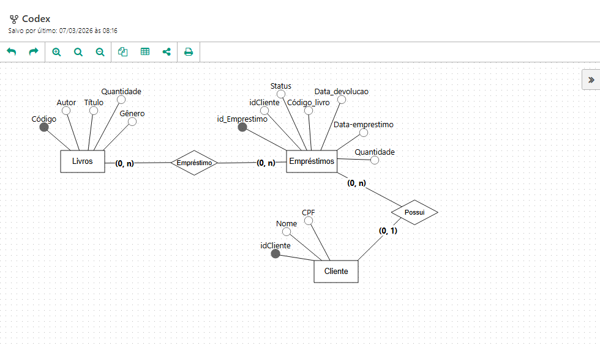

# Projeto Final: Codex

## Biblioteca Virtual

#### Sistema de Gerenciamento de livros:

### Funções : 
-  Login
- Cadastrar Livro
- Movimentar Livro (Registar Entrada e Saida)
- Listar Livros
- Editar Livros

#### Diagrama de Banco de Dados:

#### Distribuição de Tarefas:
https://trello.com/b/Wqn5Fyke/projeto-ifba

#### Colaboradores:

- Yuri Aragão
- Jessica Sacramento
- Alex Ramos
